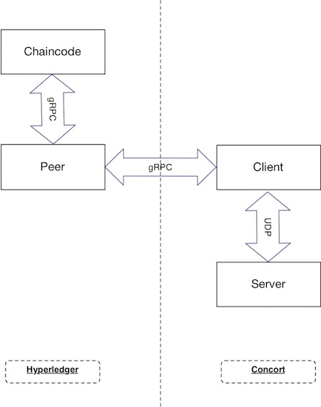

# A modification of the concord-bft SimpleKVBC store.

Concord-bft provide a SimpleKVBC as a show case for the underline bft algorithm. I modify the client of the SimpleKV to implement the [gRPC Protocol](https://github.com/nickcen/fabric/blob/concord_kv/core/ledger/util/concorddb/msgs/concord.proto) so that it can handle the read/write request from the Peer node of Hyperledger.